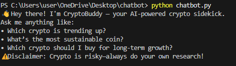
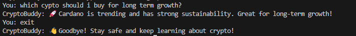

# 💰 CryptoBuddy – Your First AI-Powered Financial Sidekick! 🌟

CryptoBuddy is a beginner-friendly, rule-based chatbot built in Python that provides simple investment advice for cryptocurrencies. It helps users evaluate options based on **profitability** and **sustainability** using predefined crypto data.

---

## 📌 Features

- Answers questions like:
  - “Which crypto is trending up?”
  - “What’s the most sustainable coin?”
  - “Which crypto should I buy for long-term growth?”
- Analyzes data on:
  - Price trend
  - Market cap
  - Energy use
  - Sustainability score
- Simple decision logic using `if-else`

---
## 📸 Screenshots

### 🤖 Chatbot Startup


### 🌱 Sustainability Advice


### 🚀 Investment Recommendation

## 🚀 How to Run

1. Clone the repo or download the project folder.
2. Open the folder in **VS Code** (or your IDE of choice).
3. Make sure Python 3 is installed.
4. Run the chatbot:

```bash
python chatbot.py

